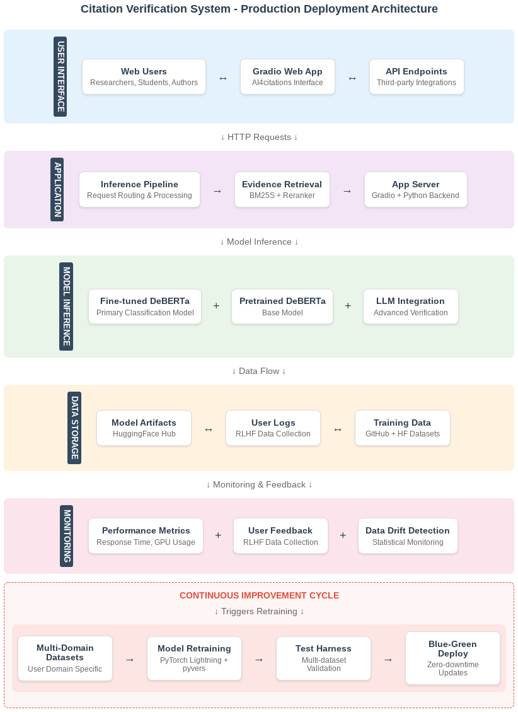

# Step 10: Citation Verification System Deployment Architecture

**Student:** Jeffrey Dick  
**Date:** May 28, 2025  
**Project:** ML Engineering Capstone - AI-Powered Citation Verification

## Executive Summary

This document outlines the production deployment architecture for the Citation Verification System, a machine learning application that classifies scientific claims as SUPPORT, REFUTE, or NEI (Not Enough Information) based on provided evidence. The system leverages multiple approaches including a fine-tuned DeBERTa model deployed on HuggingFace Spaces with GPU acceleration, LLM-powered evidence retrieval, and domain-adaptive retraining strategies designed to handle diverse user populations while maintaining cost-effectiveness and scalability.

## Architecture Overview

  

[HTML source](architecture-diagram.html) -- [HTML preview](http://htmlpreview.github.io/?https://github.com/jedick/MLE-capstone-project/blob/main/notebooks/architecture-diagram.html)

*[Architecture Diagram - Figure 1: Citation Verification System Production Deployment Architecture showing the complete system flow from user interface through model inference, data storage, and continuous improvement cycles]*

### Major System Components

The production architecture comprises five primary layers that handle the complete lifecycle from user interaction to model improvement.
- The User Interface Layer serves as the primary entry point through the Gradio web application hosted on AI4citations, providing both interactive web access for researchers and programmatic REST API access for third-party integrations.
- The Application Layer orchestrates the core business logic through an inference pipeline that manages evidence preprocessing, and model selection.
The BM25S implementation is used to extract relevant sentences from PDFs. 
- The Model Inference Layer represents the core intelligence of the system, featuring primary DeBERTa model fine-tuned on SciFact and Citation-Integrity datasets.
GPU infrastructure utilizes Nvidia T4 instances on HuggingFace Spaces.
- The Data Storage Layer maintains comprehensive version control and artifact management through the HuggingFace Hub for model artifacts. User interaction logs capture detailed performance metrics and feedback for RLHF data collection.
- The Monitoring and Operations Layer provides real-time visibility into system performance through comprehensive metrics tracking, user feedback collection, and statistical monitoring for data drift detection. 

## Design Decisions & Technology Choices

### Model Architecture Strategy

The fine-tuned DeBERTa model provides the primary classification capability, maintaining the 7 percentage point F1 improvement over baseline models.

LLM integration offers complementary capabilities for complex evidence retrieval and one-shot verification scenarios where traditional fine-tuned models may struggle. However, this approach introduces significant cost and latency tradeoffs. Running the test harness on 300 examples with LLM-based verification would cost approximately $7.20 per run (300 × 20,000 tokens × $1/1M input tokens + 300 × 1,000 tokens × $4/1M output tokens), making it suitable for high-value scenarios but impractical for routine testing.

### Infrastructure and Deployment Strategy

HuggingFace Spaces remains the primary deployment platform due to its cost-effectiveness and integration benefits.

## System Inputs and Outputs

The system processes diverse input types to accommodate various user workflows and integration scenarios.
- Primary inputs include text pairs consisting of claims and evidence statements, with support for both direct text entry and PDF document upload for evidence extraction.
- Secondary inputs encompass user feedback for model improvement, configuration preferences for model selection, and domain-specific metadata that influences retraining decisions.

System outputs provide:
- classification predictions (SUPPORT/REFUTE/NEI) with confidence scores
- visualizations showing probability distributions across classes
- retrieved evidence sentences with relevance rankings
- response times

## Data Flow and Lifecycle

### Request Processing Flow

The request processing workflow has been designed to accommodate multiple interaction modes:

• Mode 1: User submits claim-evidence pairs via web interface or API endpoint
• Mode 2: User submits claim-PDF pairs, and retrieval system extracts evidences statements from PDF
• Model selection to choose between fine-tuned model or LLM-powered verification
• Response formatting includes visualizations, evidence citations, and performance metadata
• Interaction logging captures detailed metrics for monitoring and future training data

### Model Lifecycle Management

Model versioning and deployment supports domain-specific adaptations.
- Models are stored on HuggingFace Hub with versioning to track fine-tuning iterations.
- [TODO] Implement event-driven triggers for retraining:
  - User domain analysis
  - Performance degradation
  - Accumulated feedback volume

Deployment strategies vary by model type:
- Fine-tune transformer models supporting rapid deployment and rollback.
- LLM integrations require careful cost monitoring and evaluations for model updates.
- Blue-green deployment ensures zero-downtime updates
  - Automatic rollback capabilities if performance metrics fall below established thresholds during the validation window.

## Retraining and Continuous Improvement

### Performance Evaluation and Metrics

The evaluation framework has these components:
- F1 score as the primary performance metric, as it provides balanced assessment of precision and recall across the three-class classification problem.
- Test harnesses utilize held-out test sets from both SciFact and Citation-Integrity datasets, providing consistent benchmarks across retraining iterations
- Additional metrics include inference latency to ensure comprehensive performance assessment.

### Automated Retraining Triggers

Retraining occurs through both statistical monitoring and usage-based triggers. Data drift detection analyzes input distribution changes that may indicate new user populations or evolving claim patterns. Performance degradation alerts trigger immediate investigation and potential retraining when accuracy drops below established thresholds. User feedback accumulation triggers domain-specific retraining when sufficient annotated examples become available from particular user communities.

## Cost Analysis and Tradeoffs

### Infrastructure and Model Costs

Monthly operating costs reflect the multi-tiered approach with baseline infrastructure at $11/month for GPU instances and storage, periodic retraining averaging $15/month across quarterly cycles, and variable LLM costs ranging from $0-100/month depending on usage patterns. The total estimated range of $26-126/month provides flexibility to scale service levels based on user demand and performance requirements.

### LLM Integration Tradeoffs

LLM integration introduces significant cost and performance considerations that must be carefully balanced against accuracy benefits. While LLM-powered verification can achieve higher accuracy on complex claims, the computational cost is approximately 10-15x higher than fine-tuned model inference. Latency increases from sub-second response times to 5-15 seconds for complex document processing, potentially impacting user experience for interactive applications.

The cost structure makes LLM verification most suitable for high-value use cases such as publication review, grant evaluation, or regulatory compliance where accuracy justifies increased expenses. For routine verification tasks, the fine-tuned LORA models provide optimal cost-performance balance while maintaining high accuracy standards.

## Scalability and Future Enhancement

### Operational Excellence

The system architecture emphasizes procedural automation to ensure reproducible results and efficient debugging workflows. All training pipelines, evaluation procedures, and deployment processes are fully scripted and version-controlled, enabling complete result regeneration through simple command execution. This approach significantly reduces debugging time and ensures consistent results across development, testing, and production environments.

### Enhancement Roadmap

- Claim detection to automatically decompose complex input text into atomic claims for more granular verification
  - Use LLM-powered prompts based on FActScore/SAFE studies. 
  - Expanded utility for document-level verification and comprehensive fact-checking workflows.
- Update the AI4citations interface to provide user-configurable options for reranking algorithms, model selection preferences, and LLM integration based on accuracy and cost requirements. This flexibility allows users to optimize the verification process for their specific needs and budget constraints.
- Incorporate advanced NLP augmentation techniques to improve model robustness. These augmentation strategies particularly benefit domain adaptation when transitioning between scientific fields, as they help models generalize across varying writing styles and technical vocabularies while maintaining semantic accuracy.
  - Reverse translation through multiple language pairs;
  - Context-aware synonym replacement.
- Acquire new training datasets for domain-specific retraining scenarios.
- Trigger automated retraining workflows:
  - when sufficient user feedback is obtained
  - when performance degradation is detected
  - when new training data from other user domains are available

### Long-Term Strategy: Domain-Adaptive Retraining

The retraining strategy acknowledges the diverse user base and varying domain requirements through intelligent dataset selection and trigger mechanisms. When user analytics indicate increased traffic from specific domains (e.g., clinical research vs. general science), the system automatically initiates domain-specific retraining using relevant datasets from the expanded corpus.

Available datasets for domain-specific adaptation include ReferenceErrorDetection for general academic claims, CliniFact for clinical research verification, DisFact for disaster-related claims, SC20 for high-impact journal citations, and CSR23 for humanities quotation accuracy. This comprehensive dataset library enables targeted improvements that directly address user community needs while maintaining general performance.

## Implementation Timeline and Next Steps

**Phase 1 (Current)**: Initial Deployment

**Next Steps**: 
1. Upgrade app to HuggingFace Spaces with GPU and persistent storage for performance metrics and user feedback
2. Activate monitoring and logging
3. Begin user feedback collection
4. Integrate reranker into AI4citations app

**Phase 2 (Next 30 days)**: LLM integration for evidence retrieval and comprehensive test harness implementation

**Phase 3 (Next 60 days)**: Domain-adaptive retraining pipeline, LORA optimization, and expanded dataset integration

This comprehensive architecture provides a robust foundation for production deployment while maintaining the flexibility necessary for continuous improvement and domain adaptation. The design successfully balances cost-effectiveness with performance requirements, ensuring the system can serve diverse user communities while evolving through feedback and retraining cycles.

## Pre-Deployment Checklist - Citation Verification System

**Project**: ML Engineering Capstone - Scientific Citation Verification  
**Deployment Target**: HuggingFace Spaces with GPU acceleration  
**Date**: May 27, 2025  

### ✅ 1. Problem Definition & Requirements

#### 1.1 Problem Definition
- [x] **Problem Statement**: Automated validation of scientific citations and claims to classify as SUPPORT, REFUTE, or NEI
- [x] **Success Criteria**: Achieve >60% macro F1 score across test datasets (Current: 66% average F1)
- [x] **Target Users**: Researchers, students, authors, and academic institutions
- [x] **Use Case Validation**: Manual verification is time-consuming; automated solution provides efficiency gains

#### 1.2 Solution Requirements
- [x] **Functional Requirements**: 
  - Classify claim-evidence pairs with confidence scores
  - Handle both direct text input and PDF evidence extraction
  - Provide visualization of prediction probabilities
- [ ] **Performance Requirements**: 
  - Response time <5 seconds per query
  - Support for concurrent users (initial target: 10-50 concurrent)
- [ ] **Reliability Requirements**: 99% uptime target with graceful degradation

### ✅ 2. Data Preparation & Quality

#### 2.1 Training Data
- [x] **Data Sources Identified**: SciFact (1,409 claims) and Citation-Integrity (3,063 instances)
- [x] **Data Quality Assessment**: Completed data wrangling notebooks documenting quality issues
- [x] **Label Consistency**: Unified labeling scheme implemented in pyvers package
- [x] **Data Split Strategy**: Train/validation/test splits preserved from original datasets

#### 2.2 Production Data Pipeline
- [x] **Input Validation**: Text preprocessing and length limits implemented
- [x] **Data Format Standardization**: Consistent tokenization using DeBERTa tokenizer
- [x] **Evidence Retrieval**: BM25S implementation for PDF processing
- [ ] **Error Handling**: Graceful handling of malformed inputs and edge cases

### ✅ 3. Model Development & Validation

#### 3.1 Model Architecture
- [x] **Model Selection**: DeBERTa v3 chosen based on NLI performance and domain fit
- [x] **Baseline Comparison**: 7 percentage point improvement over MultiVerS baselines
- [x] **Architecture Documentation**: Model card and documentation on HuggingFace Hub
- [x] **Hyperparameter Tuning**: Completed systematic tuning using PyTorch Lightning

#### 3.2 Model Validation
- [x] **Cross-Dataset Evaluation**: Tested on both SciFact and Citation-Integrity test sets
- [x] **Performance Metrics**: Macro F1, AUROC, and per-class metrics calculated
- [x] **Zero-Shot Baseline**: Base model performance documented for comparison
- [ ] **Edge Case Testing**: Tested with short claims, long evidence, and ambiguous cases

#### 3.3 Model Artifacts
- [x] **Model Versioning**: Stored on HuggingFace Hub with version tags
- [x] **Reproducibility**: Training pipeline documented in pyvers package
- [x] **Model Size**: 400MB model size acceptable for deployment target
- [x] **Inference Speed**: <2 seconds per prediction on GPU instance

### ✅ 4. Infrastructure & Deployment

#### 4.1 Deployment Platform
- [x] **Platform Selection**: HuggingFace Spaces chosen for cost-effectiveness and simplicity
- [x] **Resource Requirements**: Nvidia T4 GPU instance specified and tested
- [ ] **Scaling Strategy**: Automatic scaling provided by HF Spaces
- [x] **Backup Strategy**: Model artifacts stored on HF Hub with version control

#### 4.2 Application Architecture
- [x] **Web Interface**: Gradio app developed and tested (AI4citations)
- [x] **API Design**: REST API endpoints documented and functional
- [x] **Load Balancing**: Handled by HF Spaces infrastructure
- [ ] **Error Handling**: Comprehensive error handling and user feedback

#### 4.3 Security & Privacy
- [x] **Data Privacy**: User inputs not stored unless opted-in for feedback
- [ ] **API Security**: Rate limiting considerations documented [^1]
- [x] **Model Security**: Access controls on model artifacts
- [x] **Compliance**: No PII or sensitive data handling required

### ✅ 5. Monitoring & Observability

#### 5.1 Performance Monitoring
- [x] **Metrics Definition**: Response time, GPU utilization, memory usage
- [ ] **Alerting Strategy**: Performance degradation thresholds defined
- [x] **Logging Implementation**: User interaction logging for RLHF
- [ ] **Dashboard Planning**: Key metrics identified for monitoring dashboard

#### 5.2 Data Quality Monitoring
- [x] **Drift Detection Strategy**: Statistical comparison of input distributions
- [x] **Feedback Collection**: User rating system for RLHF implementation
- [ ] **Data Validation**: Input format and content validation rules
- [ ] **Anomaly Detection**: Unusual query patterns and response times

### ✅ 6. Testing & Quality Assurance

#### 6.1 Functional Testing
- [x] **Unit Tests**: Core functions tested in pyvers package
- [ ] **Integration Tests**: End-to-end pipeline tested
- [x] **User Acceptance Testing**: Manual testing of web interface
- [ ] **Performance Testing**: Load testing with concurrent requests [^1]

#### 6.2 Model Testing
- [x] **Regression Testing**: Model performance benchmarks established
- [ ] **A/B Testing Framework**: Comparison methodology defined
- [ ] **Fallback Testing**: Base model fallback mechanism tested [^1]
- [ ] **Edge Case Validation**: Boundary conditions and error cases tested

### ✅ 7. Operations & Maintenance

#### 7.1 Deployment Process
- [x] **Deployment Pipeline**: GitHub integration with HF Spaces configured
- [x] **Rollback Strategy**: Previous model versions available for quick reversion
- [ ] **Blue-Green Deployment**: Strategy defined for zero-downtime updates
- [ ] **Release Documentation**: Deployment procedures documented

#### 7.2 Maintenance Planning
- [x] **Retraining Schedule**: Quarterly reviews and trigger-based retraining
- [x] **Model Updates**: Process for incorporating new training data
- [ ] **Dependency Management**: Package versions pinned and documented
- [ ] **Backup Procedures**: Model and configuration backup strategy

### ✅ 8. Cost Management

#### 8.1 Cost Analysis
- [x] **Infrastructure Costs**: $6/month GPU + $5/month storage = $11/month base
- [x] **Training Costs**: $10/month averaged for periodic retraining
- [x] **Monitoring Costs**: $0-50/month for optional enhanced monitoring (MLFlow)
- [x] **Total Budget**: $21-71/month ($252-852/year) approved and documented

#### 8.2 Cost Optimization
- [x] **Resource Utilization**: GPU usage optimized for inference-only workloads
- [x] **Storage Optimization**: Log rotation and cleanup procedures defined
- [ ] **Scaling Economics**: Cost per user calculated and monitored
- [x] **Alternative Assessments**: AWS/GCP comparison completed for future scaling

### ✅ 9. Documentation & Knowledge Transfer

#### 9.1 Technical Documentation
- [x] **API Documentation**: Gradio auto-generated API docs available
- [x] **Architecture Documentation**: System design documented in deployment plan
- [ ] **Runbooks**: Operational procedures documented
- [ ] **Troubleshooting Guide**: Common issues and solutions documented

#### 9.2 User Documentation
- [x] **User Guide**: Web interface usage instructions
- [ ] **API Guide**: Integration documentation for developers
- [ ] **FAQ**: Common questions and use cases addressed [^1]
- [ ] **Performance Expectations**: Response times and accuracy documented

### ✅ 10. Launch Readiness

#### 10.1 Go-Live Checklist
- [ ] **Environment Validation**: Production environment tested and validated
- [x] **Performance Baseline**: Initial metrics and benchmarks established
- [ ] **Monitoring Active**: All monitoring and alerting systems operational
- [ ] **Support Process**: Issue escalation and support procedures defined

#### 10.2 Post-Launch Planning
- [ ] **Success Metrics**: User adoption and performance KPIs defined
- [ ] **Feedback Collection**: User feedback mechanisms active
- [ ] **Iteration Planning**: Enhancement roadmap for next 3-6 months
- [ ] **Scale Planning**: Growth scenarios and scaling triggers identified

---

[^1]: Discuss whether to remove these checklist items.
